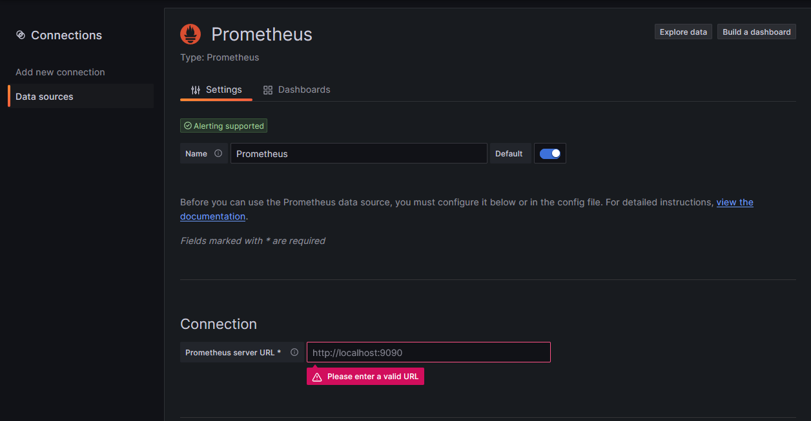
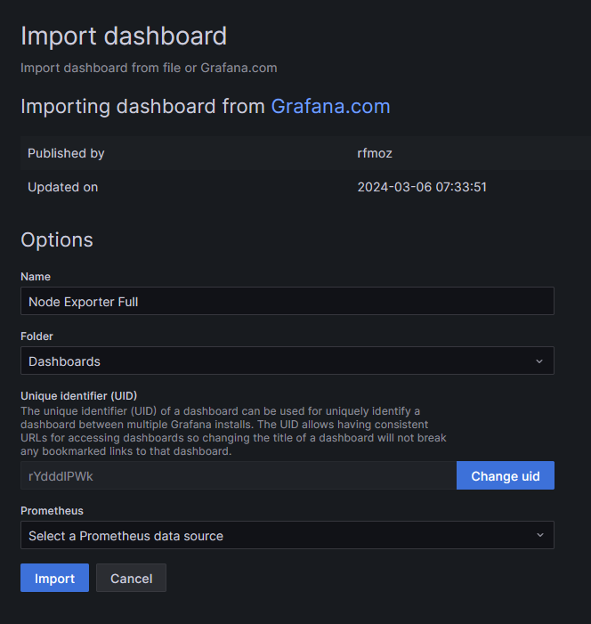

# Installation guide for Grafana and Prometheus

## Introduction

In this guide, we explain how to install and configure a metrics dashboard on a server.


Here is the expected result from [Grafana website](https://grafana.com/grafana/dashboards/1860-node-exporter-full/") :


## Installation

This section has for goal to install services for server monitoring (disk usage...) in real time.

### [Grafana](https://grafana.com/docs/grafana/latest/setup-grafana/installation/docker/)

1. Copy the `docker-compose.yaml` in your server :

   ```yaml
   version: '3'

   services:
      grafana:
         image: grafana/grafana-enterprise
         container_name: grafana
         restart: unless-stopped
         user: root
         # We change the port, because it's use by the Helix Authentication Service.
         ports:
            - '4000:3000'
         volumes:
            - ./storage:/var/lib/grafana
            - ./logs:/var/log/grafana
         # networks:
            # - nginx-proxy

   # networks:
   #   nginx-proxy:
   #     external: true
   ```

2. (Optional) If you want to use an anonymous account, pull `grafana/grafana-enterprise` from portainer :

   ```bash
   sudo docker pull grafana/grafana-enterprise
   ```

3. Launch your container :

   ```bash
   sudo docker-compose up --build -d
   ```

   Docker compose will use two volumes to keep data and logs persistent even if a container stop or restart.

4. Go to http://<YOUR_SRV_IP>:4000/.

5. On the sign-in page, enter admin for both the username and password.

6. Click Sign in.

7. If successful, you’ll see a prompt to change the password.

8. Click OK on the prompt and change your password.

### [Prometheus](https://grafana.com/docs/grafana-cloud/send-data/metrics/metrics-prometheus/prometheus-config-examples/docker-compose-linux/)

1. Copy the `docker-compose.yaml` in your server :

   ```yaml
   version: '3'

   services:
      node-exporter:
         image: prom/node-exporter:latest
         container_name: node-exporter
         restart: unless-stopped
         volumes:
            - /proc:/host/proc:ro
            - /sys:/host/sys:ro
            - /:/rootfs:ro
         command:
            - '--path.procfs=/host/proc'
            - '--path.rootfs=/rootfs'
            - '--path.sysfs=/host/sys'
            - '--collector.filesystem.mount-points-exclude=^/(sys|proc|dev|host|etc)($$|/)'
         network_mode: host
         pid: host
         # networks:
         #   - nginx-proxy

      prometheus:
         image: prom/prometheus:latest
         container_name: prometheus
         ports:
            - '9090:9090'
         restart: unless-stopped
         volumes:
            - ./prometheus.yml:/etc/prometheus/prometheus.yml
            - ./data:/prometheus
         command:
            - '--config.file=/etc/prometheus/prometheus.yml'
            - '--storage.tsdb.path=/prometheus'
            - '--web.console.libraries=/etc/prometheus/console_libraries'
            - '--web.console.templates=/etc/prometheus/consoles'
            - '--web.enable-lifecycle'
         # networks:
         #   - nginx-proxy

   # networks:
   #   nginx-proxy:
   #     external: true
   ```

2. Next to the docker compose, create a `prometheus.yml` file. It will define prometheus configuration (scape interval...).

   ```yaml
   global:
      scrape_interval: 5m

   scrape_configs:
      - job_name: 'prometheus'
         static_configs:
            - targets: ['localhost:9090']

      - job_name: 'node'
         static_configs:
            - targets: ['<YOUR_TARGET_IP>:9100']
   ```

3. Replace <YOUR_TARGET_IP> in `prometheus.yml` by the server ip you want to audit.

4. (Optional) If you want to use an anonymous account, pull `prom/prometheus` and `prom/node-exporter` from portainer :

   ```bash
   sudo docker pull prom/prometheus && sudo docker pull prom/node-exporter
   ```

5. Install Prometheus and Node Exporter :

   ```bash
   sudo docker-compose up --build -d
   ```

6. Go to http://<YOUR_SRV_IP>:<PROMETHEUS_PORT>/ and you will see this interface :
   

## Configuration

1. On Grafana, go to `Connections > Data sources` to add a new data sources.

2. Click on `Add data sources` and search for Prometheus.

3. Now, you only have to set your prometheus url in the following interface then click on `Save & Test`.
   

4. Go back to the home page and click on `Dashboards > Create a Dashboard > Import dashboard`.

5. Load the dashboard 1860, it's the [Node Exporter Full Dashboard](https://grafana.com/grafana/dashboards/1860-node-exporter-full/).
   You can find more dashboard in [Grafana website](https://grafana.com/grafana/dashboards/).
   

6. Now, select your Prometheus source then click on `Import`.
   

## References

- [Grafana installation](https://grafana.com/docs/grafana/latest/setup-grafana/installation/docker/)
- [Grafana docker configuration](https://grafana.com/docs/grafana/latest/setup-grafana/configure-docker/)
- [Monitor a server with Grafana and Prometheus](https://grafana.com/docs/grafana-cloud/send-data/metrics/metrics-prometheus/prometheus-config-examples/docker-compose-linux/)
- [Node Exporter Full Dashboard](https://grafana.com/grafana/dashboards/1860-node-exporter-full/)
- [Grafana Dashboard](https://grafana.com/grafana/dashboards/)
