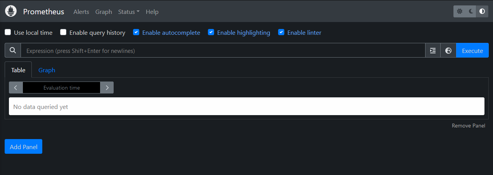
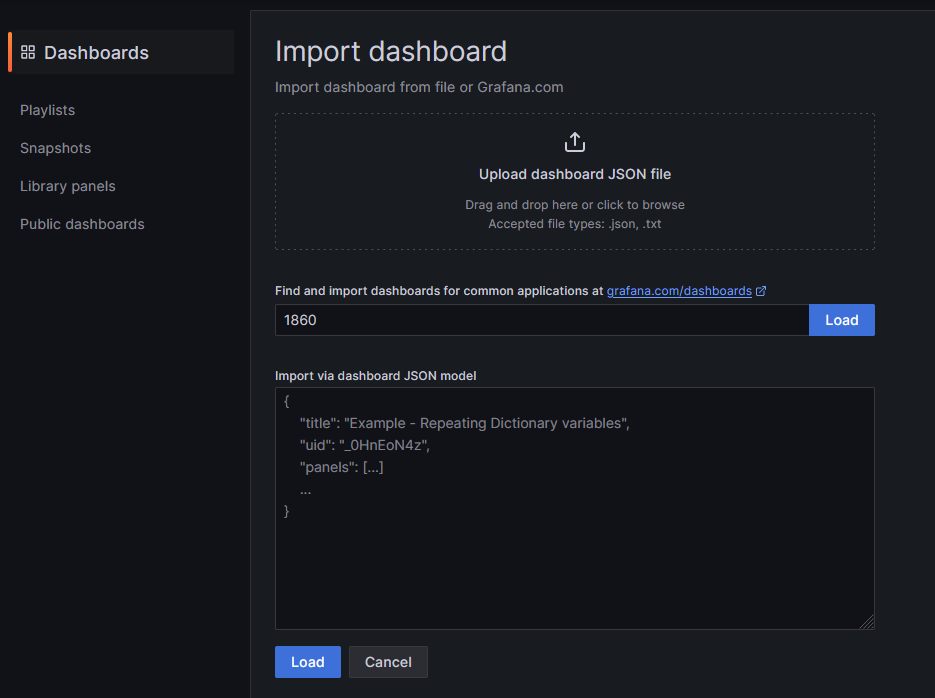

# Installation guide for Grafana and Prometheus

## Introduction

In this guide, we explain how to install and configure a metrics dashboard on a server.

## Installation

This section has for goal to install services for server monitoring (disk usage...) in real time.

### [Grafana](https://grafana.com/docs/grafana/latest/setup-grafana/installation/docker/)

1. Create a Grafana folder :

   ```bash
   mkdir /srv/dockers/grafana && cd /srv/dockers/grafana
   ```

2. Copy all files of the repository under `configuration/grafana` in the grafana folder of your server.

3. (Optional) If you want to use an anonymous account, pull `grafana/grafana-enterprise` from portainer.

4. Install Grafana :

   ```bash
   docker compose up -d
   ```

   Docker compose will use two volumes to keep datas and logs persistent even if a container stop or restart.

5. Go to http://<YOUR_SRV_IP>:4000/.

6. On the sign-in page, enter admin for both the username and password.

7. Click Sign in.

8. If successful, you’ll see a prompt to change the password.

9. Click OK on the prompt and change your password.

### [Prometheus](https://grafana.com/docs/grafana-cloud/send-data/metrics/metrics-prometheus/prometheus-config-examples/docker-compose-linux/)

1. Create a Prometheus folder :

   ```bash
   mkdir /srv/dockers/prometheus && cd /srv/dockers/prometheus
   ```

2. Copy all files of the repository under 'configuration/prometheus' in the prometheus folder of your server. A prometheus config file is present next to the docker compose, it's define the default behavior (scape interval...).

3. (Optional) If you want to use an anonymous account, pull `prom/prometheus` and `prom/node-exporter` from portainer.

4. Replace <YOUR_TARGET_IP> in `prometheus.yml` by the server ip you want to audit.

5. Install Prometheus and Node Exporter :

   ```bash
   docker compose up -d
   ```

6. Go to http://<YOU_SRV_IP>:<PROMETHEUS_PORT>/ and you will see this interface :
   

## Configuration

1. On Grafana, go to `Connections > Data sources` to add a new data sources.
 
2. Click on `Add data sources` and search for Prometheus.

3. Now, you only have to set your prometheus url in the following interface then click on `Save & Test`.
   

4. Go back to the home page and click on `Dashboards > Create a Dashboard > Import dashboard`.

5. Load the dashboard 1860, it's the [Node Exporter Full Dashboard](https://grafana.com/grafana/dashboards/1860-node-exporter-full/).
   You can find more dashboard in [Grafana website](https://grafana.com/grafana/dashboards/).
   

6. Now, select your Prometheus source then click on `Import`.
   

## References

- [Grafana installation](https://grafana.com/docs/grafana/latest/setup-grafana/installation/docker/)
- [Grafana docker configuration](https://grafana.com/docs/grafana/latest/setup-grafana/configure-docker/)
- [Monotor a Server with Grafana and Prometheus](https://grafana.com/docs/grafana-cloud/send-data/metrics/metrics-prometheus/prometheus-config-examples/docker-compose-linux/)
- [Node Exporter Full Dashboard](https://grafana.com/grafana/dashboards/1860-node-exporter-full/)
- [Grafana Dashboard](https://grafana.com/grafana/dashboards/)